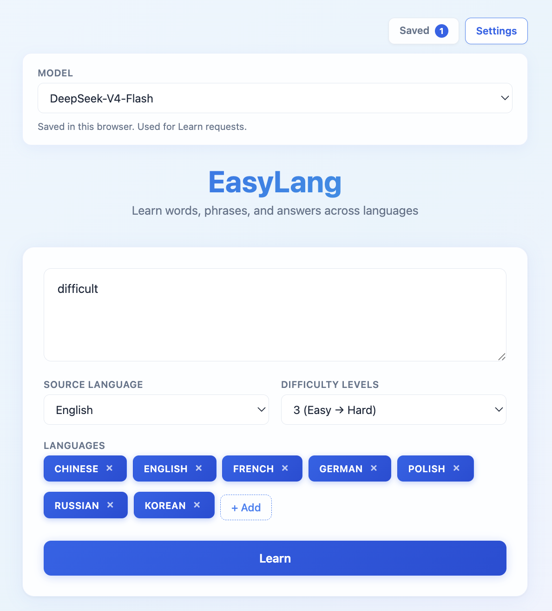
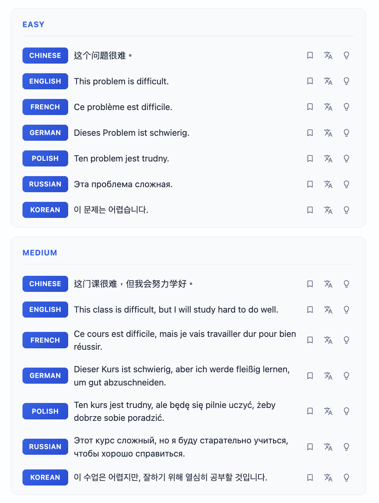

# EasyLang

Learn words, phrases, and answers across multiple languages.

EasyLang is a small **Flask** web app: a Python backend (`app.py`) talks to any OpenAI-compatible API, and a vanilla HTML/CSS/JS frontend renders results in the browser.

<p>
  
</p>
<p>
  
</p>

## Setup

Open a terminal, clone the repo, and enter the project folder:

```bash
git clone https://github.com/mcjkurz/easylang.git
cd easylang
```

Then create a virtual environment and install dependencies:

```bash
python3 -m venv venv
source venv/bin/activate
pip install -r requirements.txt
cp .env.example .env
```

Edit `.env` with your API credentials and models:

```
API_KEY=your_api_key_here
API_BASE_URL=https://api.openai.com/v1
API_MODELS=GPT-5.4-Nano,GPT-5.4-Mini,Claude-Sonnet-4.6,GPT-5.4
API_DEFAULT_MODEL=GPT-5.4-Mini
HOST=127.0.0.1
PORT=6353
PASSWORD=
```

`API_MODELS` is a comma-separated list shown in Settings. `API_DEFAULT_MODEL` must be one of those IDs. Set `PASSWORD` to require unlock before use; leave it empty for open access.

Examples for `API_BASE_URL`:
- OpenAI: `https://api.openai.com/v1`
- Poe: `https://api.poe.com/v1`
- Local proxy: `http://localhost:8000/v1`

## Run

```bash
./start.sh
```

Open the URL printed by `start.sh` (default http://127.0.0.1:6353).

Logs for each run are written under `logs/`.

## Project layout

| Path | Role |
|------|------|
| `app.py` | Flask server — `/search`, `/explain`, `/models` |
| `templates/`, `static/` | Frontend UI |
| `prompts/` | LLM prompt templates (edit these to change model behavior) |
| `.env` | API key, base URL, models, host/port (not committed) |

## Editing prompts

Prompt text lives in plain files under `prompts/` so you can tweak wording without digging through Flask routes:

- `prompts/search.txt` — Learn requests (examples / answers by difficulty across languages)
- `prompts/explain.txt` — grammar + word-gloss analysis when you click the lightbulb

Placeholders like `{phrase}` or `{sentence}` are filled in by the app. After editing a prompt file, restart the server (or rely on Flask debug reload if `FLASK_DEBUG=1`).

## Notes

- Target languages, model choice, explanations cache, and saved sentences are stored in the browser (`localStorage`).
- Never commit `.env` — it is gitignored.
